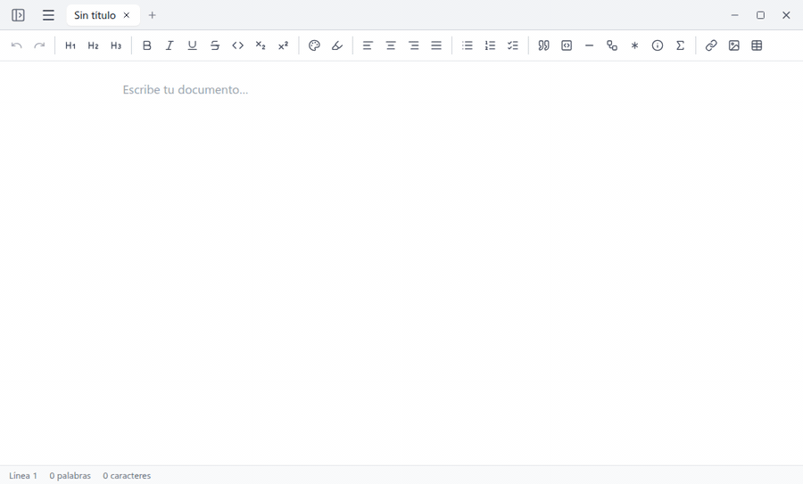
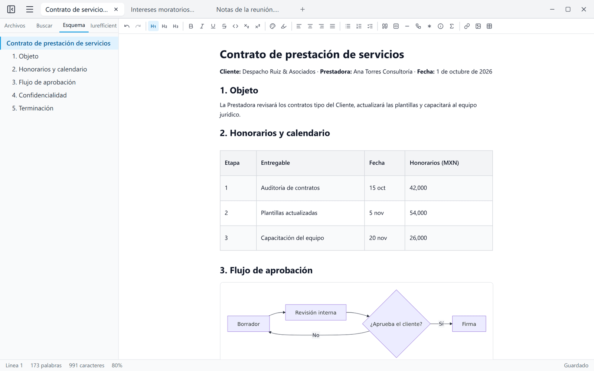
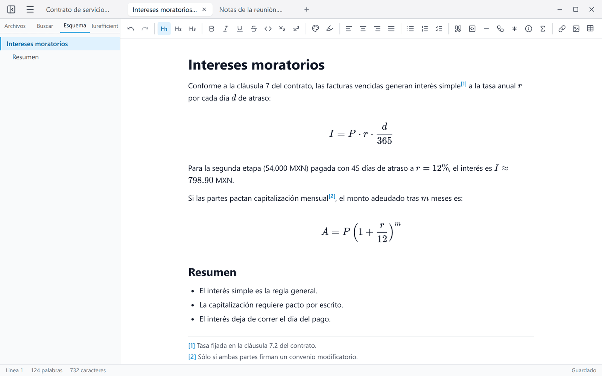
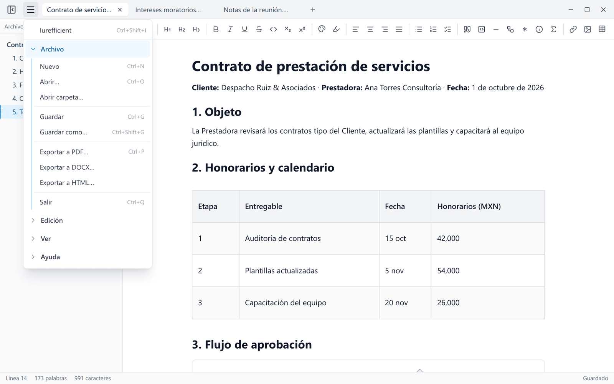
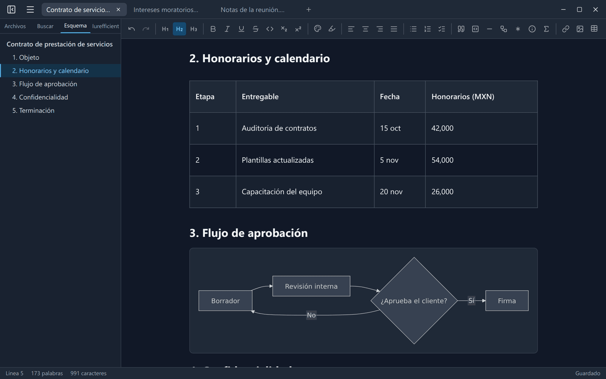

[Read in English](README.md)

<p align="center">
  
</p>
<h1 align="center">iureditor</h1>
<p align="center">
  Escribe Markdown como texto enriquecido, con diagramas Mermaid y LaTeX en vivo, y expórtalo a PDF, Word o HTML.
</p>
<p align="center">
  <a href="https://github.com/ellaguno/iureditor/releases/latest"></a>
  <a href="https://github.com/ellaguno/iureditor/releases"></a>
  <a href="LICENSE"></a>
  
</p>
<p align="center">
  <a href="https://github.com/ellaguno/iureditor/releases/latest"><b>Descargar para Linux · Windows · macOS</b></a>
</p>

<p align="center">
  
</p>

## ¿Por qué iureditor?

- **La sintaxis de Markdown no estorba.** Escribe `#`, `-` o `**` y al instante es un título, una lista o negritas; el archivo en disco sigue siendo un `.md` normal que se abre y se guarda sin cambios.
- **Diagramas y fórmulas dentro del documento.** Los bloques ` ```mermaid ` se dibujan como diagramas y `$…$` como fórmulas LaTeX mientras escribes, sin panel de vista previa aparte.
- **Documentos listos para entregar.** Exporta a PDF con texto seleccionable y diagramas vectoriales, a DOCX que abren Word y LibreOffice (con notas al pie reales) o a un HTML autosuficiente.
- **Local y privado.** Los documentos se editan en tu computadora; sin cuenta y sin telemetría. La única conexión opcional es con tu propia instancia de Iurefficient.
- **Libre y de código abierto** (Apache 2.0) para Linux, Windows y macOS.

## Capturas

<table>
  <tr>
    <td width="50%"></td>
    <td width="50%"></td>
  </tr>
  <tr>
    <td>Encabezados, tablas y un diagrama Mermaid en vivo, con el esquema del documento.</td>
    <td>Fórmulas LaTeX y notas al pie, editadas en su lugar.</td>
  </tr>
  <tr>
    <td width="50%"></td>
    <td width="50%"></td>
  </tr>
  <tr>
    <td>Pestañas y el menú: exportar a PDF, DOCX o HTML.</td>
    <td>Tema oscuro, con diagramas Mermaid legibles.</td>
  </tr>
</table>

## Características

- **Editor WYSIWYG**: edita markdown como texto enriquecido (encabezados, listas —incluidas anidadas—, tablas, tareas, código con resaltado de sintaxis, imágenes, enlaces). Escribe `/` para un menú rápido de bloques (encabezados, listas, tabla, diagrama, fórmula, avisos…).
- **Round-trip fiel markdown ↔ HTML**: los archivos `.md` se conservan estables al abrir y guardar.
- **Pestañas**: varios documentos abiertos a la vez, cada uno con su propio historial de deshacer. `Ctrl+W` cierra la pestaña y `Ctrl+Tab` cambia entre ellas; una pestaña se puede desacoplar en su propia ventana.
- **Mermaid en vivo**: los bloques ` ```mermaid ` se renderizan como diagrama dentro del editor; clic para editar el código. Exporta cada diagrama a SVG o PNG.
- **Fórmulas LaTeX**: `$inline$` y `$$bloque$$` renderizadas con KaTeX dentro del editor; clic sobre la fórmula para editarla.
- **Notas al pie**: sintaxis `[^1]` de markdown, con botón de inserción y numeración automática. En DOCX se exportan como notas al pie reales de Word.
- **Índice**: inserta una tabla de contenido con enlaces a los encabezados (Edición → Insertar índice); los exports HTML/PDF llevan las anclas correspondientes.
- **Front matter YAML**: los metadatos `---` al inicio del archivo se preservan (visibles en la vista de código fuente, excluidos de los exports).
- **Exportación**: PDF (texto seleccionable, diagramas vectoriales, fórmulas como MathML), DOCX (compatible con Word y LibreOffice) y HTML autosuficiente.
- **Imágenes locales**: pega o arrastra imágenes y se guardan junto al documento en `assets/` con referencias relativas.
- **Plantillas**: empieza un documento desde una plantilla (Archivo → Nueva desde plantilla); las plantillas son archivos `.md` en una carpeta que se abre desde el mismo menú.
- **Recuperación de borradores**: si la app se cierra mal, al reabrir ofrece recuperar lo no guardado de todas las pestañas.
- **Vista de código fuente, esquema del documento, panel de carpeta, búsqueda y reemplazo (también en los archivos de la carpeta, y con `\n` para saltos de línea), números de línea, corrector ortográfico, tema claro/oscuro y zoom.**
- **Interfaz en inglés y español**: la app arranca en inglés, o en español si el sistema operativo está en español; se puede fijar el idioma en Ver → Language / Idioma.

## Descarga e instalación

Descarga la versión más reciente desde la [página de releases](https://github.com/ellaguno/iureditor/releases/latest). Los archivos se llaman `iureditor_<versión>_<plataforma>`:

| Plataforma | Archivo | Notas |
|---|---|---|
| Windows (64 bits) | `…_1-windows-x64.exe` | Instalador. Ver la nota sobre SmartScreen abajo. |
| macOS (Apple Silicon e Intel) | `…_2-macos-universal.dmg` | Una sola compilación universal. Ver la nota sobre Gatekeeper abajo. |
| Linux (x64), cualquier distribución | `…_3-linux-x64.AppImage` | Dale permiso de ejecución y ábrelo. |
| Debian / Ubuntu | `…_3-linux-x64.deb` | `sudo apt install ./iureditor_…_3-linux-x64.deb` |

Los archivos `.sig`, el `.app.tar.gz` y `latest.json` los usa el actualizador integrado; no hace falta descargarlos.

> **Los instaladores todavía no están firmados.** En Windows, SmartScreen puede mostrar «Windows protegió su PC» (editor desconocido): haz clic en **Más información → Ejecutar de todas formas**. En macOS la app no está notarizada: la primera vez, haz clic derecho sobre la app y elige **Abrir**, o ve a **Configuración del Sistema → Privacidad y seguridad → Abrir de todas formas**. Detalles en la [Code signing policy](#code-signing-policy).

### Actualizaciones

Unos segundos después de arrancar, iureditor revisa los releases de este repositorio en GitHub por si hay una versión nueva y pregunta antes de descargar nada (también se puede revisar desde Ayuda → Buscar actualizaciones…). Las actualizaciones se verifican con la firma del actualizador del proyecto antes de instalarse. En Linux, una instalación por `.deb` se actualiza con el paquete `.deb` (pide la contraseña de administrador) y un AppImage con el AppImage.

### Solución de problemas en Linux

Si la ventana aparece en blanco o parpadea (NVIDIA/Wayland), prueba:

```bash
WEBKIT_DISABLE_DMABUF_RENDERER=1 iureditor
```

## Conexión con Iurefficient (opcional)

Desde el panel lateral (pestaña Iurefficient, `Ctrl+Shift+I`) puedes iniciar sesión en tu instancia de Iurefficient para abrir documentos de tus proyectos, guardar ahí un documento como nuevo y subir versiones nuevas (a demanda o en cada `Ctrl+G`). La contraseña no se guarda; sólo la sesión, en el llavero del sistema operativo. El mismo panel muestra las demás apps de escritorio de Iurefficient y si están instaladas.

iureditor también abre enlaces `iureditor://open?path=…` y archivos `.md` pasados por línea de comandos o con doble clic.

## Parte de la suite Iurefficient

| App | Qué hace |
|---|---|
| [IureTranscribe](https://github.com/ellaguno/iuretranscribe) | Transcripción local con Whisper, grabación en vivo con quién habló, resumen y minuta. |
| **iureditor** | Editor Markdown WYSIWYG con Mermaid, LaTeX y exportación a PDF/DOCX. |
| [IureDav](https://github.com/ellaguno/iuredav) | Monta un servidor WebDAV (o Iurefficient) como unidad. |
| [IureOCR](https://github.com/ellaguno/iureocr) | OCR local que convierte escaneos en PDF con texto buscable. |
| [iureTI](https://github.com/ellaguno/iureTI) | Sonda de descubrimiento de activos de TI para el inventario de Iurefficient. |

## Contribuir

Los issues y pull requests son bienvenidos. Buenas primeras contribuciones:

- **Reportes de errores** con los pasos para reproducirlos, tu plataforma y, si se puede, un `.md` pequeño que muestre el problema.
- **Traducciones**: nuevos idiomas para la interfaz (los textos están en `src/lib/i18n.ts`).
- **Documentación**: correcciones y ejemplos.

Para compilar y probar la app, ve [Desarrollo](#desarrollo) abajo.

## Desarrollo

<details>
<summary>Compilar desde el código, tests, CI y medios del README</summary>

Requisitos: Node.js ≥ 20, Rust (stable) y las dependencias de Tauri para tu plataforma
(en Linux: `libwebkit2gtk-4.1-dev`, `librsvg2-dev`, `build-essential`, `libssl-dev` — ver
[prerrequisitos de Tauri](https://tauri.app/start/prerequisites/)).

```bash
npm install
npm run tauri dev     # app de escritorio en modo desarrollo
npm test              # tests (round-trip markdown)
npm run tauri build   # binarios (AppImage/.deb en Linux)
```

Construido con [Tauri v2](https://tauri.app), React y [TipTap](https://tiptap.dev).

- **CI** (`.github/workflows/ci.yml`): revisión de tipos, tests y build del frontend en cada push a `main` y en cada pull request.
- **Releases** (`.github/workflows/release.yml`): al empujar un tag `vX.Y.Z` se compilan los paquetes de Windows, macOS (universal) y Linux, se publican con las notas de la sección de esa versión en `CHANGELOG.md` y se genera `latest.json` para el actualizador.
- **Capturas y GIF** de este README: `scripts/readme-media/` (instrucciones en su README).

</details>

## Code signing policy

- **Windows:** por ahora los instaladores **no** tienen firma Authenticode, así que SmartScreen puede advertir de un editor desconocido («Más información → Ejecutar de todas formas»).
- **macOS:** la app no está notarizada por Apple; la primera vez se abre con clic derecho → Abrir (o Configuración del Sistema → Privacidad y seguridad → Abrir de todas formas).
- Todos los instaladores los compila GitHub Actions a partir de este repositorio (`.github/workflows/release.yml`) y sólo se publican en la [página de releases](https://github.com/ellaguno/iureditor/releases).
- Los paquetes de actualización van firmados con la clave del actualizador de Tauri del proyecto (archivos `.sig` referenciados en `latest.json`), y la app comprueba esa firma antes de instalar una actualización.
- **Committers, revisores y aprobadores de releases:** Eduardo Llaguno ([@ellaguno](https://github.com/ellaguno)).

### Privacy policy

This program will not transfer any information to other networked systems unless
specifically requested by the user or the person installing or operating it.

Specifically, iureditor connects only to:

- the Iurefficient instance that the user configures, and only when the user
  signs in or opens, saves or lists documents there;
- GitHub (`github.com`, the `latest.json` file of this repository's releases), once
  a few seconds after start-up and when the user chooses Help → Check for updates,
  to check whether a newer release exists. Nothing is downloaded or installed
  without asking first;
- `api.github.com`, only when the user opens the Iurefficient side panel (or
  refreshes its list of apps), to show the latest version of the Iurefficient
  desktop apps.

It collects no telemetry and no usage statistics. Documents are edited locally.
Credentials are stored in the operating system keychain, never in configuration
files.

*Política de privacidad: este programa no transfiere información a otros sistemas
en red salvo que lo pida expresamente el usuario o quien lo instala u opera. Sólo
se conecta a la instancia de Iurefficient que configure el usuario (al iniciar
sesión o al abrir, guardar o listar documentos ahí), a GitHub unos segundos después
de arrancar y al buscar actualizaciones (nada se descarga ni instala sin preguntar)
y a `api.github.com` sólo al abrir el panel de Iurefficient, para mostrar la última
versión de las apps de escritorio de Iurefficient. No recopila telemetría ni
estadísticas de uso; los documentos se editan localmente y las credenciales se
guardan en el llavero del sistema operativo, nunca en archivos de configuración.*

## Licencia

[Apache License 2.0](LICENSE)
