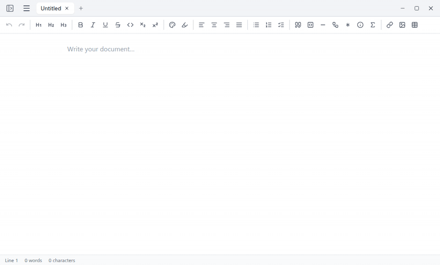
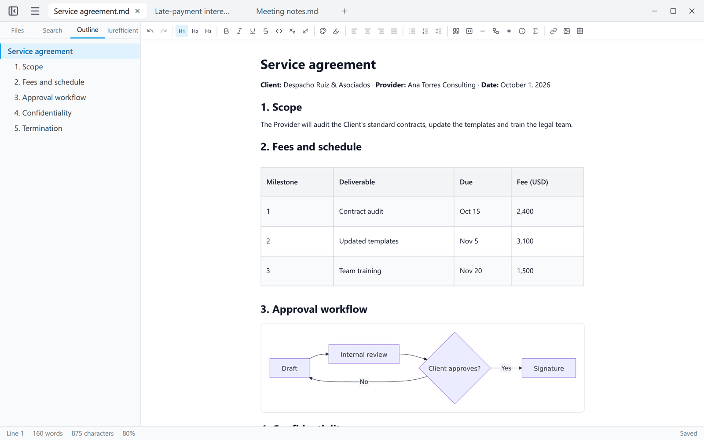
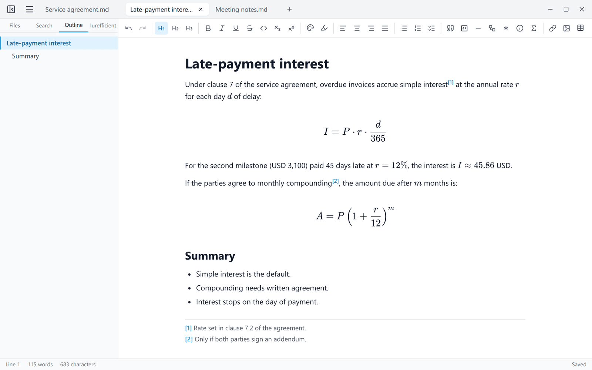
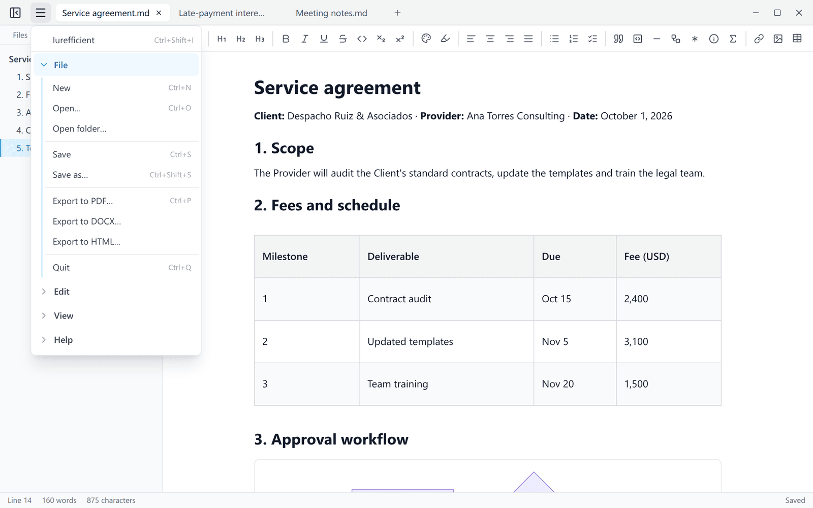
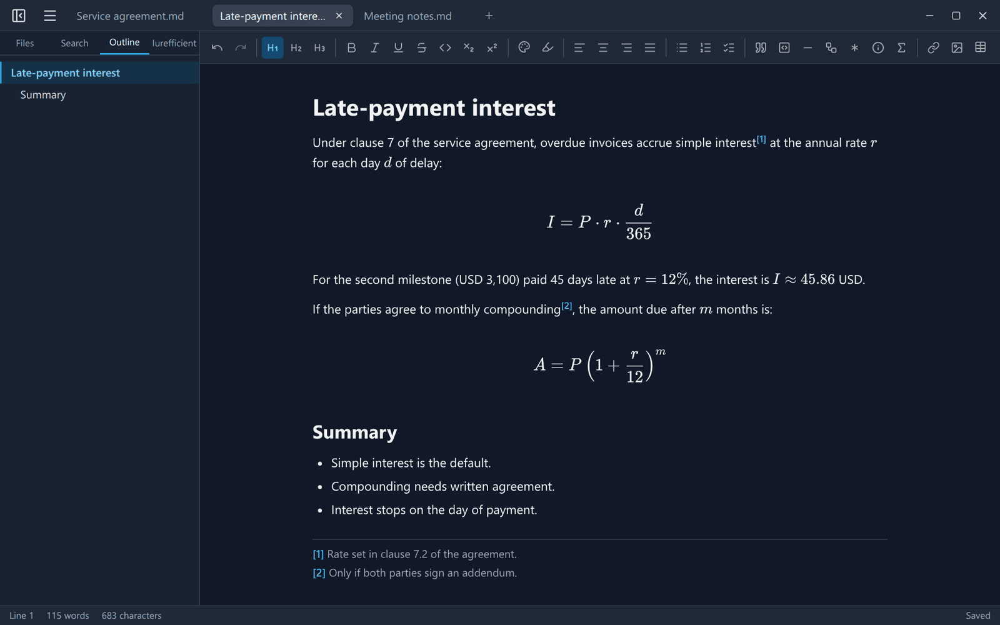

[Leer en español](README.es.md)

<p align="center">
  
</p>
<h1 align="center">iureditor</h1>
<p align="center">
  Write Markdown as rich text, with live Mermaid diagrams and LaTeX, and export it to PDF, Word or HTML.
</p>
<p align="center">
  <a href="https://github.com/ellaguno/iureditor/releases/latest"></a>
  <a href="https://github.com/ellaguno/iureditor/releases"></a>
  <a href="LICENSE"></a>
  
</p>
<p align="center">
  <a href="https://github.com/ellaguno/iureditor/releases/latest"><b>Download for Linux · Windows · macOS</b></a>
</p>

<p align="center">
  
</p>

## Why iureditor

- **No Markdown syntax in your way.** Type `#`, `-` or `**` and it becomes a heading, a list or bold text right away; the file on disk is still plain `.md` and opens and saves without changes.
- **Diagrams and formulas inside the document.** ` ```mermaid ` blocks render as diagrams and `$…$` as LaTeX formulas while you write, with no separate preview pane.
- **Documents ready to hand over.** Export to PDF with selectable text and vector diagrams, to DOCX that Word and LibreOffice open (with real footnotes), or to a self-contained HTML file.
- **Local and private.** Documents are edited on your computer; no account, no telemetry. The only optional connection is to your own Iurefficient instance.
- **Free and open source** (Apache 2.0) for Linux, Windows and macOS.

## Screenshots

<table>
  <tr>
    <td width="50%"></td>
    <td width="50%"></td>
  </tr>
  <tr>
    <td>Headings, tables and a live Mermaid diagram, with the document outline.</td>
    <td>LaTeX formulas and footnotes, edited in place.</td>
  </tr>
  <tr>
    <td width="50%"></td>
    <td width="50%"></td>
  </tr>
  <tr>
    <td>Tabs and the menu: export to PDF, DOCX or HTML.</td>
    <td>Dark theme.</td>
  </tr>
</table>

## Features

- **WYSIWYG editor**: edit markdown as rich text (headings, lists —including nested ones—, tables, tasks, code with syntax highlighting, images, links). Type `/` for a quick menu of blocks (headings, lists, table, diagram, formula, callouts…).
- **Faithful markdown ↔ HTML round-trip**: `.md` files stay stable when opened and saved.
- **Tabs**: several documents open at once, each with its own undo history. `Ctrl+W` closes the tab and `Ctrl+Tab` switches between them; a tab can be moved to its own window.
- **Live Mermaid**: ` ```mermaid ` blocks render as diagrams inside the editor; click to edit the code. Export each diagram to SVG or PNG.
- **LaTeX formulas**: `$inline$` and `$$block$$` rendered with KaTeX inside the editor; click a formula to edit it.
- **Footnotes**: markdown `[^1]` syntax, with an insert button and automatic numbering. In DOCX they are exported as real Word footnotes.
- **Table of contents**: inserts a table of contents linking to the headings (Edit → Insert table of contents); HTML/PDF exports include the matching anchors.
- **YAML front matter**: the `---` metadata at the top of the file is preserved (visible in the source code view, excluded from exports).
- **Export**: PDF (selectable text, vector diagrams, formulas as MathML), DOCX (compatible with Word and LibreOffice) and self-contained HTML.
- **Local images**: paste or drag images and they are saved next to the document in `assets/` with relative references.
- **Templates**: start a document from a template (File → New from template); templates are `.md` files in a folder you can open from the same menu.
- **Draft recovery**: if the app closes unexpectedly, on reopening it offers to recover unsaved work from every tab.
- **Source code view, document outline, folder panel, find and replace (also across the folder's files, and with `\n` for line breaks), line numbers, spell checker, light/dark theme and zoom.**
- **English and Spanish interface**: the app starts in English, or in Spanish if the operating system is set to Spanish; the language can be set in View → Language / Idioma.

## Download and install

Get the latest version from the [releases page](https://github.com/ellaguno/iureditor/releases/latest). Files are named `iureditor_<version>_<platform>`:

| Platform | File | Notes |
|---|---|---|
| Windows (64-bit) | `…_1-windows-x64.exe` | Installer. See the SmartScreen note below. |
| macOS (Apple Silicon and Intel) | `…_2-macos-universal.dmg` | One universal build. See the Gatekeeper note below. |
| Linux (x64), any distribution | `…_3-linux-x64.AppImage` | Make it executable and open it. |
| Debian / Ubuntu | `…_3-linux-x64.deb` | `sudo apt install ./iureditor_…_3-linux-x64.deb` |

The `.sig` files, the `.app.tar.gz` and `latest.json` are used by the built-in updater; you don't need to download them.

> **The installers are not code-signed yet.** On Windows, SmartScreen may show "Windows protected your PC" (unknown publisher): click **More info → Run anyway**. On macOS the app is not notarized: the first time, right-click the app and choose **Open**, or go to **System Settings → Privacy & Security → Open Anyway**. Details in the [Code signing policy](#code-signing-policy).

### Updates

A few seconds after start-up, iureditor checks this repository's releases on GitHub for a newer version and asks before downloading anything (you can also check from Help → Check for updates…). Updates are verified against the project's updater signature before they are installed. On Linux, a `.deb` installation is updated with the `.deb` package (it asks for the administrator password) and an AppImage with the AppImage.

### Troubleshooting on Linux

If the window shows up blank or flickers (NVIDIA/Wayland), try:

```bash
WEBKIT_DISABLE_DMABUF_RENDERER=1 iureditor
```

## Iurefficient connection (optional)

From the side panel (Iurefficient tab, `Ctrl+Shift+I`) you can sign in to your Iurefficient instance to open documents from your projects, save a document there as a new one, and upload new versions (on demand or on every `Ctrl+S`). The password is not stored; only the session, in the operating system keychain. The same panel lists the other Iurefficient desktop apps and whether they are installed.

iureditor also opens `iureditor://open?path=…` links and `.md` files passed on the command line or by double-click.

## Part of the Iurefficient suite

| App | What it does |
|---|---|
| [IureTranscribe](https://github.com/ellaguno/iuretranscribe) | Local Whisper transcription, live recording with who-spoke, summaries and minutes. |
| **iureditor** | WYSIWYG Markdown editor with Mermaid, LaTeX and PDF/DOCX export. |
| [IureDav](https://github.com/ellaguno/iuredav) | Mount a WebDAV server (or Iurefficient) as a drive. |
| [IureOCR](https://github.com/ellaguno/iureocr) | Local OCR that turns scans into searchable PDFs. |
| [iureTI](https://github.com/ellaguno/iureTI) | IT asset discovery probe for the Iurefficient inventory. |

## Contributing

Issues and pull requests are welcome. Good first contributions:

- **Bug reports** with the steps to reproduce, your platform and, if possible, a small `.md` file that shows the problem.
- **Translations**: new interface languages (the strings live in `src/lib/i18n.ts`).
- **Documentation**: corrections and examples.

To build and test the app, see [Development](#development) below.

## Development

<details>
<summary>Build from source, tests, CI and README media</summary>

Requirements: Node.js ≥ 20, Rust (stable) and the Tauri dependencies for your platform
(on Linux: `libwebkit2gtk-4.1-dev`, `librsvg2-dev`, `build-essential`, `libssl-dev` — see
[Tauri prerequisites](https://tauri.app/start/prerequisites/)).

```bash
npm install
npm run tauri dev     # desktop app in development mode
npm test              # tests (markdown round-trip)
npm run tauri build   # binaries (AppImage/.deb on Linux)
```

Built with [Tauri v2](https://tauri.app), React and [TipTap](https://tiptap.dev).

- **CI** (`.github/workflows/ci.yml`): type check, tests and frontend build on every push to `main` and every pull request.
- **Releases** (`.github/workflows/release.yml`): pushing a `vX.Y.Z` tag builds the Windows, macOS (universal) and Linux packages, publishes them with the release notes taken from that version's section of `CHANGELOG.md`, and generates `latest.json` for the updater.
- **Screenshots and GIF** of this README: `scripts/readme-media/` (instructions in its README).

</details>

## Code signing policy

- **Windows:** the installers are currently **not** Authenticode-signed, so SmartScreen may warn about an unknown publisher ("More info → Run anyway").
- **macOS:** the app is not notarized by Apple; open it the first time with right-click → Open (or System Settings → Privacy & Security → Open Anyway).
- Every installer is built from this repository by GitHub Actions (`.github/workflows/release.yml`) and published only on the [releases page](https://github.com/ellaguno/iureditor/releases).
- The update packages are signed with the project's Tauri updater key (`.sig` files referenced by `latest.json`), and the app checks that signature before installing an update.
- **Committers, reviewers and release approvers:** Eduardo Llaguno ([@ellaguno](https://github.com/ellaguno)).

### Privacy policy

This program will not transfer any information to other networked systems unless
specifically requested by the user or the person installing or operating it.

Specifically, iureditor connects only to:

- the Iurefficient instance that the user configures, and only when the user
  signs in or opens, saves or lists documents there;
- GitHub (`github.com`, the `latest.json` file of this repository's releases), once
  a few seconds after start-up and when the user chooses Help → Check for updates,
  to check whether a newer release exists. Nothing is downloaded or installed
  without asking first;
- `api.github.com`, only when the user opens the Iurefficient side panel (or
  refreshes its list of apps), to show the latest version of the Iurefficient
  desktop apps.

It collects no telemetry and no usage statistics. Documents are edited locally.
Credentials are stored in the operating system keychain, never in configuration
files.

## License

[Apache License 2.0](LICENSE)
