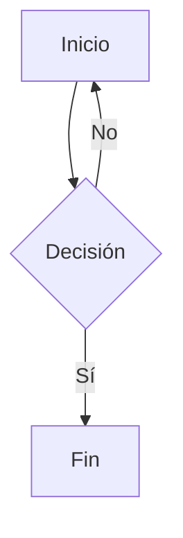

# Documento de prueba

Párrafo simple con **negritas**, *cursivas*, `código inline` y un [enlace](https://example.com).

Identificadores con metacaracteres dentro de código: `mcgenera_posicion_k`, `tabla_con_*asteriscos*` y `c_tipo_val`.

## Listas

- Elemento uno
- Elemento dos
- Elemento tres

1. Primero
2. Segundo
3. Tercero

## Tareas

- [ ] Tarea pendiente
- [x] Tarea completada

## Tabla

| Columna A | Columna B | Columna C |
| --- | --- | --- |
| celda 1 | **negrita** | dato |
| celda 2 | texto | 42 |

## Código

```python
def hola(nombre):
    # comentario con # y | y *
    return f"Hola {nombre}"
```

## Diagrama



## Cita

> Una línea citada
> otra línea citada

---

Texto final con imagen: 

Imagen con guiones bajos:  y un [enlace_con_guiones](https://example.com/ruta_con_guiones/pagina_final.html) en la misma línea.
